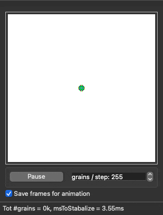
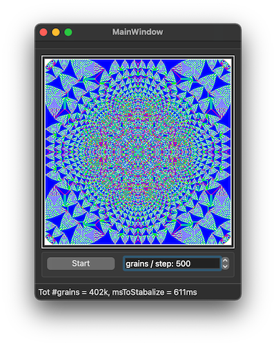

# Sandpile
A simple program that can generate an Abelian sandpile. A recording of the program in action is shown below.



## Contents
 * [Introduction](#introduction)
 * [How to run](#how-to-run)
 * [How to use](#usage)


## Introduction
The [**Abelian sandpile model**](https://en.wikipedia.org/wiki/Abelian_sandpile_model), also known as the **Bak–Tang–Wiesenfeld model** is a cellular automaton. In its original formulation, each site on a finite grid has an associated value that corresponds to the slope of the pile. This slope builds up as "grains of sand" (or "chips") are randomly placed onto the pile, until the slope exceeds a specific threshold value at which time that site collapses transferring sand into the adjacent sites, increasing their slope. 


## How to run

### Qt Creator
Start by installing the Qt5 SDK from [qt.io](https://www.qt.io/download). 
To build this projects, open the `Sandpile.pro` file with Qt Creator. Inside Qt Creator, you can first build the project, after which you can run the program.


## Usage
Running the program will show the main widget. Generating the sandpile is a dynamic process, which can be started or halted by clicking the "Start" button in the GUI.


To change the parameters of the sandpile, you must go to [`mainwindow.cpp`](source/mainwindow.cpp). Inside the constructor `MainWindow::MainWindow` you will find the following two lines:

```cpp
  this->N = 301;
  this->imgSIZE = 601;
```

You can set the size of the sandpile with `N` (the sandpile is essentially an `N` by `N` grid).
To change the size of the image displayed in the GUI, change `imgSIZE`.
